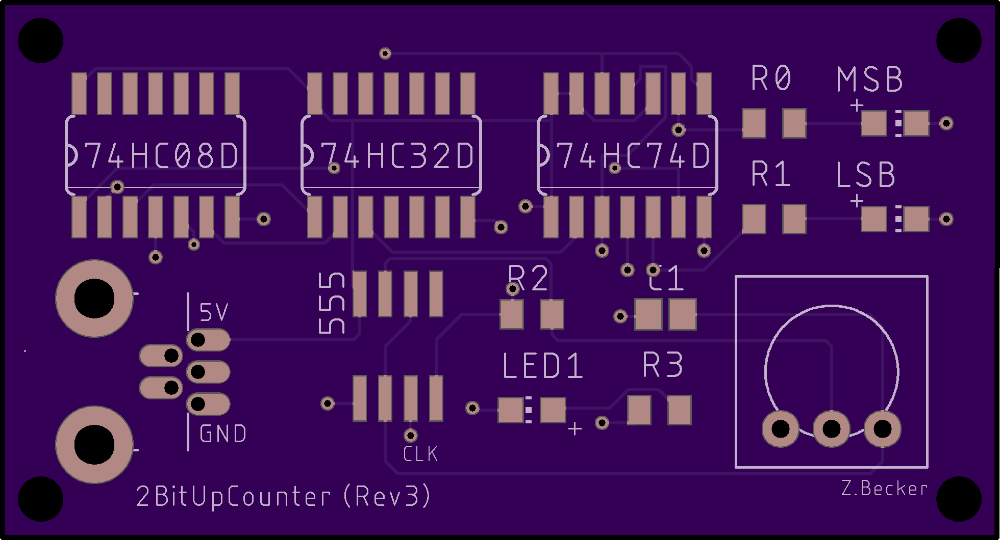
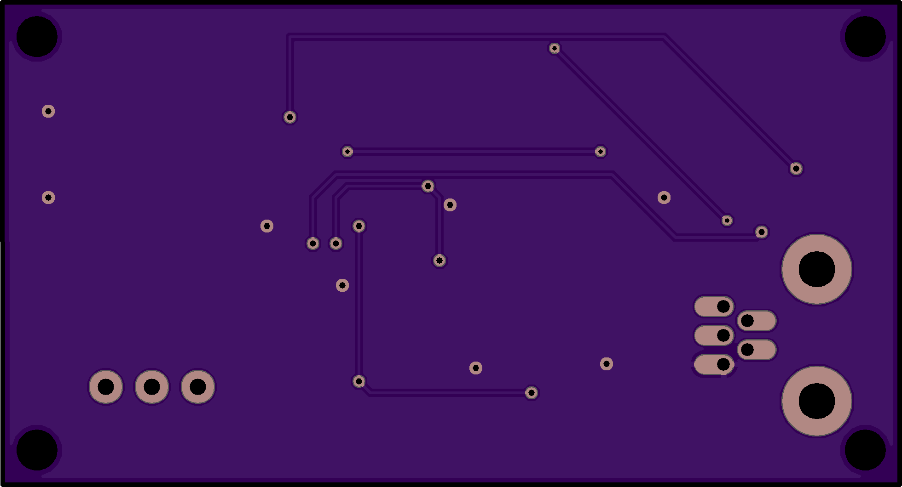

# 2BitUpCounter_pcb
2-bit State Machine PCB of a counter, with speed controlled by a potentiometer

https://github.com/bitbytebitco/2BitUpCounter_pcb/assets/45221627/b6b2ab18-c1f2-4ba4-8229-740b372daae5

_Note: Silkscreen is accidentally Big-Endian_
# PCB layouts
#### Front

#### Back

